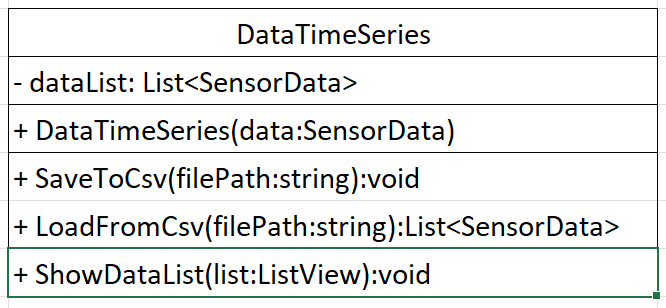
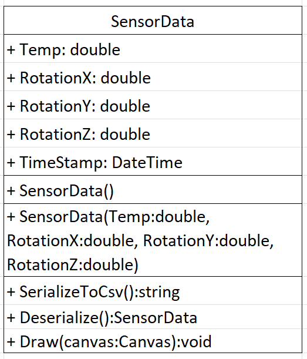

# SensorApp

Mitglieder: Vladislav Neicovcen, Talha Zengin

Kurzbeschreibung: Mit einem Raspberry PI werden Daten (Temperatur, Beschleunigung, etc.) gelesen und dargestellt.

Collage:

## Inhaltsverzeichnis

|  |
| ----------- |
| [Projektzeitplan](#projektzeitplan) |
| [Lastenheft](#lastenheft) |
| [Anteilung](#anteilung) |
| [Pflichtenheft](#pflichtenheft) |
| [Bugs / Probleme](#bugs--probleme) |
| [Erweiterungsmöglichkeiten](#erweiterungsmöglichkeiten) |

## Projektzeitplan

| Datum | Aufgabe | Bearbeiter |
| ----------- | ----------- | ----------- |
| 7. Mai | Raspberry PI konfiguriert | Vladislav |
| 7. Mai | improved GUI | Talha |
| 13. Mai | DataListWindow added | Talha |
| 14. Mai | Updated multiple classes | Talha |
| 14. Mai | Am Raspberry PI weitergearbeitet | Vladislav |
| 14. Mai | Upgraded SensorData and Mainwindow | Vladislav |
| 16. Mai | added x-Axie pillar | Vladislav |
| 21. Mai | NamingWindow added | Talha |
| 21. Mai | added Serialize and Deserialize | Vladislav |
| 21. Mai | Am Raspberry PI weitergearbeitet | Vladislav |
| 28. Mai | fixed image source and better searchbar from DataListWindow | Talha |
| 28. Mai | improved searchbar, updated savebutton | Talha |
| 28. Mai | updated ConnectionManager, SensorData & Mainwindow.cs | Vladislav |
| 28. Mai | Am Raspberry PI weitergearbeitet | Vladislav |
| 3. Juni | fixed some bugs | Vladislav |
| 3. Juni | updated GUI | Talha |
| 4. Juni | Added IP Window | Vladislav |
| 4. Juni | IP Window updated | Talha |
| 4. Juni | Got Data from sensor | Vladislav |
| 6. Juni | Data is now shown, Updated UI fixed vlaue displaying | Vladislav |
| 11. Juni | Save button almost fixed, Searchbar functioning | Talha |
| 11. Juni | Rectangles can have different colors | Vladislav |
| 13. Juni | fixed IpAdressWindow | Talha |
| 14. Juni | updated save / load / listview, collection for saving | Talha |
| 16. Juni | save, load & listview finished, logging finished | Talha |
| 16. Juni | added python code, added autocompletion | Vladislav |

## Lastenheft

**Kurzbeschreibung:** Mit einem Raspberry PI werden Daten (Temperatur, Beschleunigung, etc.) gelesen und dargestellt.

**Skizzen:** 

## Pflichtenheft

**Klassendiagramme:**

## Anteilung

**Installationsanleitung:** SeriLog muss installiert werden.

## Bugs / Probleme

### IpAddressWindow:

Bei einem leeren Eingabefeld bestätigen, wird das Programm weiterlaufen.

Warum wurde das nicht behoben?
Zeitliche Probleme

## Erweiterungsmöglichkeiten

### Sound
Wenn ein bestimmter Wert überschritten wird, soll ein Sound abgespielt werden.

### Kamera
Mit einer Kamera Bilder (z.B. 30 Bilder pro Sekunde) aufnehmen und dann anzeigen lassen.

### Durchschnittliche Werte
Für einen bestimmten Zeitraum einen durchschnittlichen Wert anzeigen lassen.