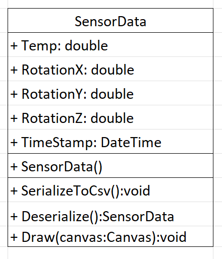
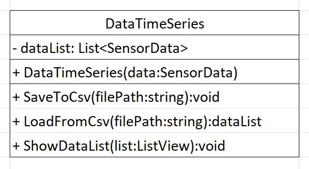

# Sensoren-App

1. Must-Haves
    - Kommunikation zwischen Rasberry Pi und WPF
    - Anzeigen von Temperaturwerten
    - Beschleunigungssensor (Neigungen & Drehungen vom Rasberry anzeigenlassen)
    - Speichern von Werten an bestimmten Zeitpunkten
    - Laden von Werten

2. Nice-to-Haves
    - andere Arten von Werten
    - Kamera
    - Interaktionen mit Laptop

3. Arbeitsteilung
    - Rasberry Pi - mit Abwechslung
    - WPF - mit Abwechslung
    - Verbindung von Hardware mit Laptop - Beide

4. Skizze
    - 

5. Klassenstruktur (Klassendiagramm)
    - 
    - 
    
